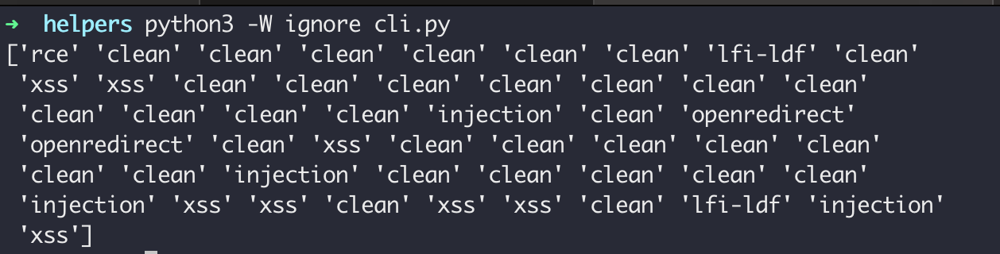

# Welcome to the Payload Detector  


This repository contains source code, notebooks, and models for the "A Machine Learning-based Malicious Payload Detection and Classification Framework for New Web Attacks" paper.


## Goodies
- Arguably the most comprehensive web attack (payload) dataset of the time, which should benefit every security researcher and company working on web application attacks. 
- A "minimalist" customized framework to do your payload machine learning projects 
- A starting place for mixing machine learning and cybersecurity 

## Limits
- Experimental code
- Only traditional ML models 
- Not battle-tested 


## Framework
Here is how our simple framework directories are structured 

### data   

- sources: sources we used to generate the final dataset 
- final: crafted final datasets from sources 

### helpers

- dataset.py: dataset generator 
- server.py: bare minimal async HTTP webserver to collect and detect attacks
- cli.py: contains model loading and prediction examples. please note it uses the base model not the optimized one by default.

### models

contains saved models from our experiments. Use with caution as you may need to rebuild your models. 

### notebooks 

- EDA: exploratory data analysis 
- Experiments: the payload detection logic and experiments.You can find some thoughts and ideas in commented codes as well.  

### paper 

- the academic paper behind this work 


## Dependencies

We suggest using Google Colab or Anaconda to manage dependencies; otherwise, installing the required packages might become overwhelming.


This framework can also act as a boilerplate for similar research. You can now use the same structure to easily manage your research.


## Base model test run

example of payloads and base (not optimized) 
RandomForest model.


```python
test_payloads = ["system(ls -la)", "xss", "crlf", "xxe", "sqli", "injection", "../../../../wow", "passwd", "etc", "onmouseover",
"<<<>>>>",
                                      "onload", "192.168.1.100:9887", "127.0.0.1", "10.255.255.255", "host", "localhost"
                                                                                                             "10.0.0.0",
                                      "172.31.255.255", "192.168.255.255", "192.168.0.0", "172.16.0.0", "wait", "count",
                                      "select", "google", "google.com", "www.google.com", "alert", "alert(1)"
                                                                                                   "bin", "bash",
                                      "curl", "where", "char", "exec", "cgi", "extractvalue", "1", "2", "3"
                                                                                                        "tftp",
                                      "192.168", "192.", "127.", "'", "<>",
                                      "<a>example.com</a>", "cmd", "<>@!@#$%^&*()_+", "<b>example.com<<>>@",
                                      "Mozilla/5.0 (X11; OpenBSD i386) AppleWebKit/537.36 (KHTML, like Gecko) "
                                      "Chrome/36.0.1985.125 Safari/537.36" , "../../etc/passwd" , "and 1=1--" , "<svg/onload=alert(0)"]
```




## Credits

- [payloadidentifier](https://github.com/tarcisio-marinho/PayloadIdentifier)
- [OWASP coreruleset](https://github.com/coreruleset/coreruleset)
- [PayloadAllTheThings](https://github.com/swisskyrepo/PayloadsAllTheThings)
- [Burp XSS cheat sheet](https://portswigger.net/web-security/cross-site-scripting/cheat-sheet)
- [ML-based WAF](https://github.com/vladan-stojnic/ML-based-WAF)
- [WAF Dataset](https://github.com/grananqvist/Machine-Learning-Web-Application-Firewall-and-Dataset)

** For academic refrences, please check the paper.


